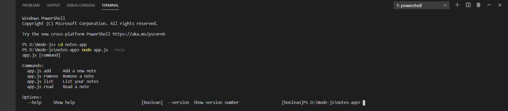
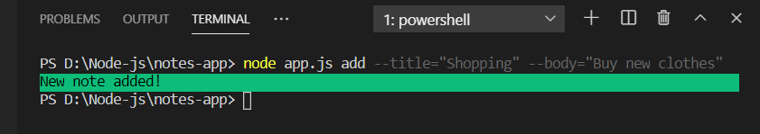
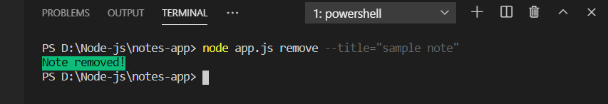
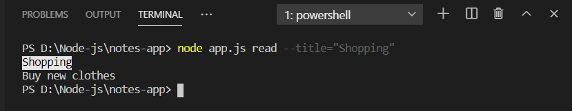
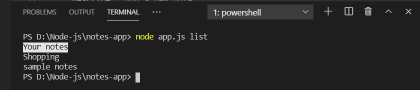

# Notes-App-CLI

CLI app written in `Node.js` for small note taking. Notes will be stored as `json` objects on directory file.

After cloning this repo, cd into `Note-App` directory and run `npm install` to install all dependencies for the project.

Using yargs in node js to get input from terminal in the application.

## Available Commands

You will be able to use the following commands

### Add

### Remove

### Read

### List

